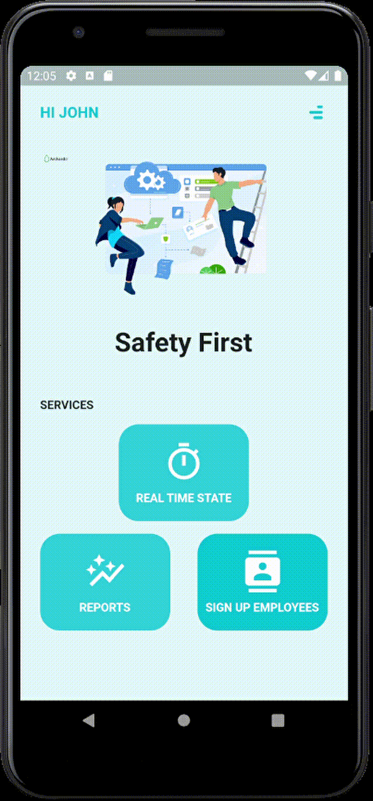

# Smart Safe Application

## Main Goal
Our application alerts about being in danger and pass the information right to Safety inspector so that he can maximize the protection of his employees' lives.

## Users
SmartSafe application is for Safety inspectors, Construction contractors, Construction site managers, who want to protect the lives of their workers and prevent injuries or death because of falls from heights.

## Screens

### Signup employees

Daily, the employer signs workers onto safety harnesses, recording each employee's name for their respective harnesses

### Push Notifications

As soon as an employee is in danger, the application sends a notification to the user alerting the employee's name and where he is.

### Reports

In the Reports screen, you can access comprehensive information about instances where workers were exposed to danger without wearing proper protective equipment. The presented table provides the following details:

- **Name:** The name of the employee who was exposed to danger.
- **Date & Time:** The specific date and time when the exposure occurred.
- **IOT:** The location within which the employee was situated at the time of the incident.

This information is crucial for monitoring workplace safety and ensuring that appropriate measures are taken to protect workers.

### Real Time State

On this screen, the user can immediately identify whether an employee is in danger at that moment or whether he is properly secured.
